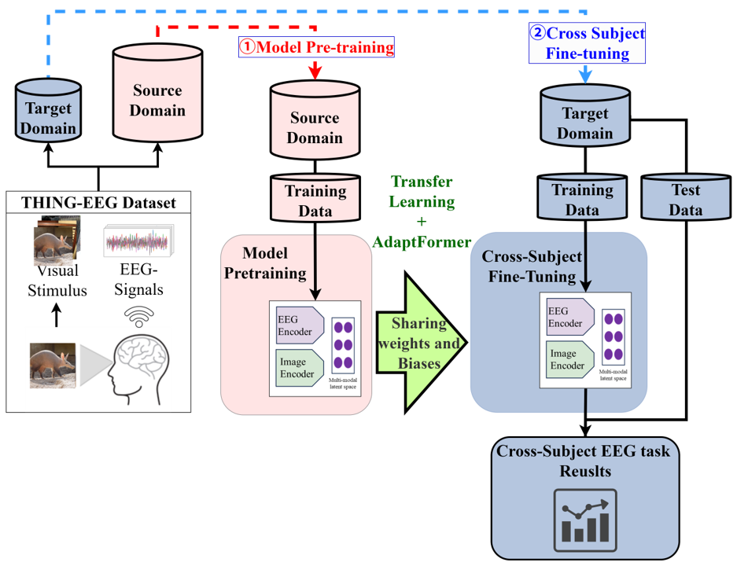

# AF-Twin and AF-EEG

This is the Pytorch implementation of this paper: **Cross-subject EEG-based Visual Object Recognition: A Contrastive and Transfer Learning Approach**
	
Yuma Sugimoto<sup>1</sup>, Genci Capi<sup>2</sup>

<sup>1</sup>the Graudate School of Science and Engineering, Hosei University, Koganei, Tokyo, Japan.

<sup>2</sup>the Department of Mechanical Engineering, Hosei University, Koganei, Tokyo, Japan.
***
## Dataset
See Section II, Subsection C, Paragraph 1 for dataset and preprocessing details.

The Things-EEG2 dataset can be downloaded following the official links. They are lireased by Gifford, A. T. in the [A large and rich EEG dataset for modeling human visual object recognition](https://www.sciencedirect.com/science/article/pii/S1053811922008758?via%3Dihub).
* [Thing-EEG2](https://osf.io/3jk45/)

### Dataset Structure Requirement
```
AF_Tiwn_and_EEG
└-- Preprocesssed_ThingEEGDataset
    |-- sub-01
    |	└-- preprocessed_eeg_test.npy
    |	└-- preprocessed_eeg_training.npy
    |-- sub-02
    |	└-- preprocessed_eeg_test.npy
    |	└-- preprocessed_eeg_training.npy
    '
    '
    '
    └-- sub-10
    	└-- preprocessed_eeg_test.npy
    	└-- preprocessed_eeg_training.npy
```
***
## Pretraining Weights
Please unzip the 'PretrainingWeights' folder in the project directory.
* Be careful of its file size (over 47 GB)

***
## Requirements
* Ubuntu==20.04.6 LTS
* Python==3.8.10
* CUDA==12.4
### Install
* pytorch==2.2.2
* numpy==1.24.4
* omegaconf==2.3.0
* tqdm==4.66.2

***
## Start Finetuning and Evaluation
```bash
$ python -m Main -s 1 -a 0 -f True
```
* '-s' argument means the target subject.
* '-a' argument manages which uses AF-Twin or AF-EEG (0.AF-Twin, 1.AF-EEG).
```bash
$ python -m Main -h
usage: Main.py [-h] [-s SUBJECT] [-a ADAPTER_MODE] [-f FINETUNING]

optional arguments:
  -h, --help            show this help message and exit
  -s SUBJECT, --subject SUBJECT
                        The target subject (from 1 to 10)
  -a ADAPTER_MODE, --adapter_mode ADAPTER_MODE
                        Types of AF: (0.AF-Twin, 1.AF-EEG)
  -f FINETUNING, --finetuning FINETUNING
                        Finetuning on the target data or not
```
## Start Only Evaluation
If you would not like to finetune on the target data, please change '-f' argument to 'False'.
* '-f' argument is whether to finetune on the target data or not.
```bash
$ python -m Main -s 1 -a 0 -f False
```
